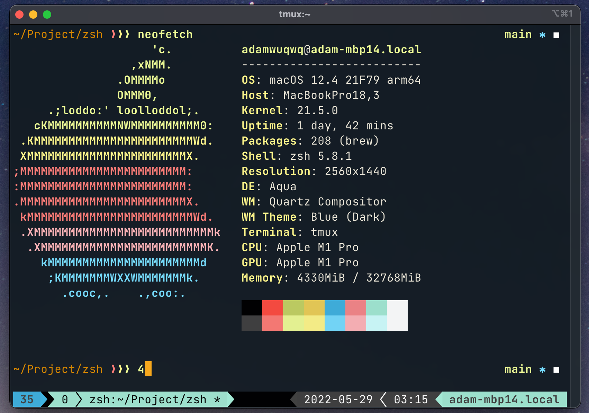

# my_shell_config

## Introduction
My shell (zsh + tmux + iterm2) configuration on macOS.  
It looks like:   

  

## Usage
### Step 1: Install dependencies
- **zsh**  
  Pre-installed on my Mac.

- **iTerm2**  
  Download from [here](https://iterm2.com/) and drag it into your application folder.

- **tmux**  
  Type `brew install tmux` in your terminal.

- **zplug**  
  Type `brew install zplug` in your terminal.

- **fzf**  
  Type `brew install fzf` in your terminal.

- **nord-tmux** (only source files are required)  
  Download from [here](https://github.com/arcticicestudio/nord-tmux`) then copy it into.

- **JetBrains mono font**  
  Install it by clicking `JetBrainsMono.ttf` in `iterm2-profile`.

### Step 2: Copy files
Please be aware of the location of your `$ZPLUG_HOME`, and correct it in `.zshrc`.  
Default location on my Mac: `/opt/homebrew/opt/zplug`, may vary depending on installation method.  

For `zsh-local`:  
- Copy it into `$ZPLUG_HOME/repos/`.  

For `.zshrc`:  
- Copy it to `~/.zshrc`.  

For `nord-tmux`:  
- Copy the folder to `~/.tmux`.  

For `.tmux.conf`:  
- Copy it to `~/.tmux.conf`.  

For prezto, make a symbolic link to your home directory:  
- Type `ln -s $ZPLUG_HOME/repos/sorin-ionescu/prezto $HOME/.zprezto` in your terminal.  

### Step 3: Configuration
1. Import the JSON profile `zsh-tmux.json` (in `iterm2-profile`) into iTerm2.
2. Set zsh as default shell:  
   Type `chsh -s $(which zsh)` in your terminal.
3. Execute `exec zsh`.
4. Execute `tmux source-file ~/.tmux.conf`

